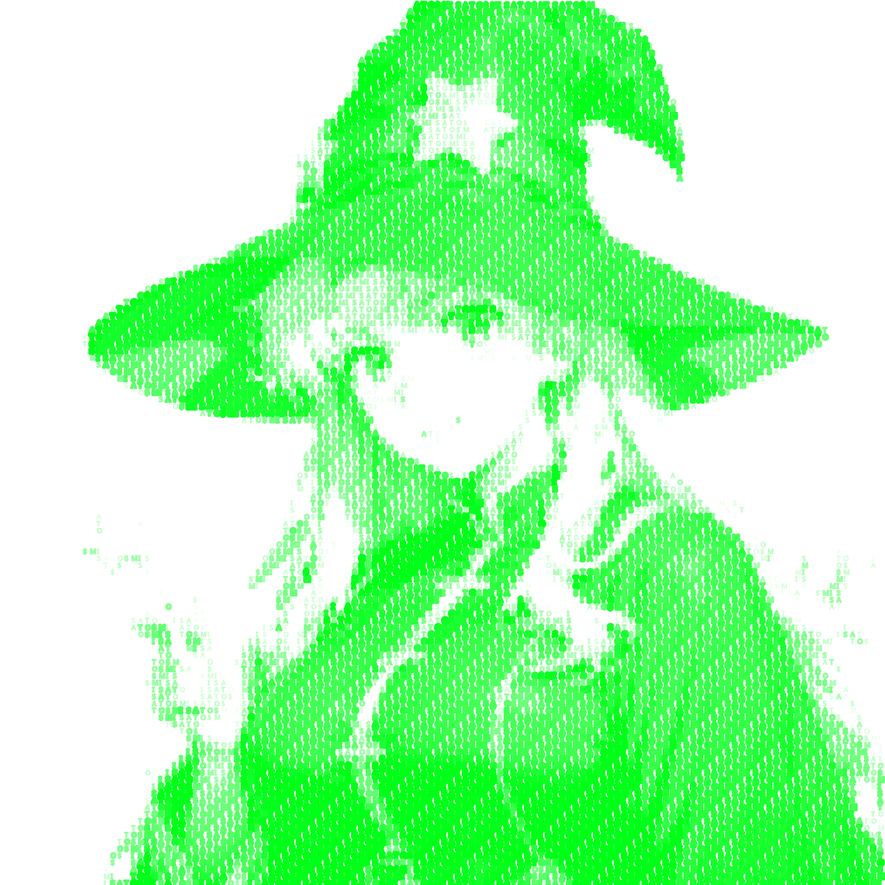

# Mythoclastia - 판타지 세계 생성기

[](https://opensource.org/licenses/MIT)
[](https://github.com/aigc3yehe/Mythoclastia/releases)
[](CONTRIBUTING.md)
[](https://github.com/ellerbrock/open-source-badges/)
[](https://reactjs.org/)



[English](README.md) | [日本語](README.ja.md) | [한국어](README.ko.md) | [繁體中文](README.zh-TW.md)

Mythoclastia은 사용자가 고유한 판타지 세계, 팀원을 만들고 전술적인 전투에 참여할 수 있는 인터랙티브 판타지 월드 생성기입니다. 이 애플리케이션은 AI 기반 텍스트 및 이미지 생성을 사용하여 몰입감 있는 게임 경험을 창출합니다.

## 🌟 기능

- **세계 생성**: 독특한 배경, 지리, 갈등을 갖춘 풍부하고 상세한 판타지 세계 창조
- **팀원**: 다양한 종족, 능력, 배경 이야기를 가진 팀원 생성 및 커스터마이징
- **전투 시스템**: 절차적으로 생성된 적과의 전술적인 턴제 전투 참여
- **멋진 시각 효과**: AI 생성 세계, 캐릭터 및 적 이미지
- **게임 상태 저장**: 진행 상황을 저장하고 모험을 계속할 수 있음

## 🚀 시작하기

### 필수 조건

- Node.js (v14.0.0 이상)
- npm (v6.0.0 이상)
- OpenAI API 키 (텍스트 생성용)
- 이미지 생성 토큰 (선택 사항, 이미지 생성용)

### 설치

1. 저장소 복제:
   ```
   git clone https://github.com/aigc3yehe/Mythoclastia.git
   cd Mythoclastia
   ```

2. 의존성 설치:
   ```
   npm install
   ```

3. 개발 서버 시작:
   ```
   npm start
   ```

4. 브라우저를 열고 `http://localhost:3000`으로 이동

## 🎮 게임 방법

1. **시작 화면**: 프롬프트를 입력하여 판타지 세계 생성
2. **로딩 단계**: AI가 세계와 팀원을 생성하는 동안 대기
   > **참고**: 세계 생성에는 시간이 걸릴 수 있습니다. 3분 이내의 처리 시간은 정상입니다.
3. **메인 게임**: 세계를 탐험하고 팀원 확인
4. **전투 모드**: 전술적인 턴제 전투 참여
   - 각 팀원의 스킬 선택
   - 다양한 유형의 적과 싸움
   - 난이도가 증가하는 여러 라운드 진행

## 🔑 API 키

이 애플리케이션은 텍스트 생성 기능을 위한 OpenAI API 키와 시각적 요소를 위한 이미지 생성 토큰(선택 사항)이 필요합니다.

### API 키 설정

1. **OpenAI API 키** (필수):
   - OpenAI API 키는 직접 준비해야 합니다
   - [OpenAI](https://platform.openai.com/)에서 계정 생성
   - 대시보드에서 API 키 생성
   - 게임 내 관리자 터미널의 설정 탭에 이 키 입력

2. **이미지 생성 토큰** (선택 사항):
   - 이미지 생성 기능은 [misato.ai](https://misato.ai)의 기술과 컴퓨팅 리소스로 제공됩니다
   - 이미지 생성 기능을 사용하려면 YeHe에게 연락하여 토큰을 얻으세요
   - 제공되지 않은 경우 생성된 이미지 대신 ASCII 아트가 표시됨
   - 관리자 터미널의 설정 탭에 이 토큰 입력

### API 키 보안 참고 사항

- API 키는 브라우저의 localStorage에 저장됨
- 키는 해당 API 제공자 외의 서버로 전송되지 않음
- API 키를 항상 비공개로 안전하게 유지하세요

## 📚 프로젝트 구조

```
src/
├── components/      # UI 컴포넌트
├── contexts/        # React 컨텍스트 제공자
├── hooks/           # 커스텀 React 훅
├── services/        # 외부 서비스 통합
├── utils/           # 유틸리티 함수
└── App.js           # 메인 애플리케이션 컴포넌트
```

## 🤝 기여하기

기여는 언제나 환영합니다! 자유롭게 Pull Request를 제출해 주세요.

1. 저장소 포크
2. 기능 브랜치 생성 (`git checkout -b feature/amazing-feature`)
3. 변경 사항 커밋 (`git commit -m '놀라운 기능 추가'`)
4. 브랜치에 푸시 (`git push origin feature/amazing-feature`)
5. Pull Request 열기

행동 강령 및 Pull Request 제출 프로세스에 대한 자세한 내용은 [CONTRIBUTING.md](CONTRIBUTING.md)를 참조하세요.

## 📄 라이선스

이 프로젝트는 MIT 라이선스에 따라 라이선스가 부여됩니다 - 자세한 내용은 [LICENSE](LICENSE) 파일을 참조하세요.

## 🙏 감사의 말

- 텍스트 생성 API를 제공하는 [OpenAI](https://openai.com/)
- 이미지 생성 기술과 컴퓨팅 파워를 제공하는 [misato.ai](https://misato.ai)
- Twitter에서 [Misato Virtuals](https://twitter.com/Misato_Virtuals)을 팔로우하세요
- UI 프레임워크를 제공하는 [React](https://reactjs.org/)
- 이 프로젝트 개선에 도움을 준 모든 기여자들 