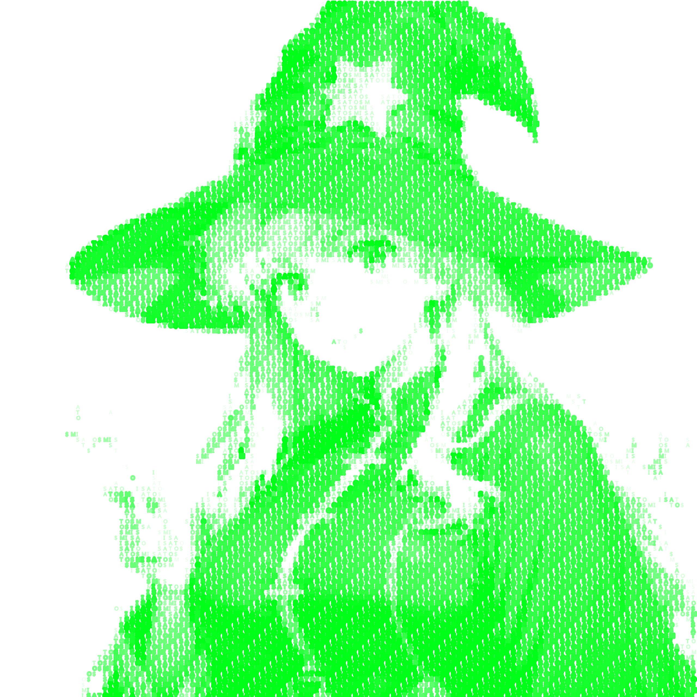

# Mythoclastia - 奇幻世界生成器

[](https://opensource.org/licenses/MIT)
[](https://github.com/aigc3yehe/Mythoclastia/releases)
[](CONTRIBUTING.md)
[](https://github.com/ellerbrock/open-source-badges/)
[](https://reactjs.org/)



[English](README.md) | [日本語](README.ja.md) | [한국어](README.ko.md) | [繁體中文](README.zh-TW.md)

Mythoclastia 是一個互動式奇幻世界生成器，允許用戶創建獨特的奇幻世界、隊員，並參與戰術戰鬥。該應用程式使用人工智能驅動的文本和圖像生成來創造身臨其境的遊戲體驗。

## 🌟 功能特色

- **世界生成**：創建豐富詳細的奇幻世界，具有獨特的設定、地理和衝突
- **隊伍成員**：生成和自定義具有不同種族、能力和背景故事的隊伍成員
- **戰鬥系統**：參與戰術回合制戰鬥，對抗程序生成的敵人
- **精美視覺效果**：AI生成的世界、角色和敵人圖像
- **遊戲進度保存**：保存您的進度並繼續冒險

## 🚀 開始使用

### 前提條件

- Node.js (v14.0.0 或更高版本)
- npm (v6.0.0 或更高版本)
- OpenAI API 密鑰 (用於文本生成)
- 圖像生成令牌 (可選，用於圖像生成)

### 安裝

1. 克隆存儲庫：
   ```
   git clone https://github.com/aigc3yehe/Mythoclastia.git
   cd Mythoclastia
   ```

2. 安裝依賴：
   ```
   npm install
   ```

3. 啟動開發服務器：
   ```
   npm start
   ```

4. 打開瀏覽器並導航至 `http://localhost:3000`

## 🎮 如何遊玩

1. **開始畫面**：輸入提示來生成您的奇幻世界
2. **加載階段**：等待 AI 生成您的世界和隊伍成員
   > **注意**：世界生成可能需要一些時間。處理時間在3分鐘內都是正常的。
3. **主遊戲**：探索您的世界並查看您的隊伍成員
4. **戰鬥模式**：參與戰術回合制戰鬥
   - 為每個隊伍成員選擇技能
   - 對抗不同類型的敵人
   - 通過多個難度遞增的回合進行

## 🔑 API 密鑰

本應用程式需要 OpenAI API 密鑰用於文本生成功能，以及可選的圖像生成令牌用於視覺元素。

### 設置 API 密鑰

1. **OpenAI API 密鑰** (必需)：
   - 您需要自行準備 OpenAI API 密鑰
   - 在 [OpenAI](https://platform.openai.com/) 創建一個賬戶
   - 從儀表板生成 API 密鑰
   - 在遊戲的管理終端設置選項卡中輸入此密鑰

2. **圖像生成令牌** (可選)：
   - 圖像生成功能由 [misato.ai](https://misato.ai) 提供技術和算力支持
   - 請聯繫 YeHe 獲取使用圖像生成功能的令牌
   - 如果未提供，將顯示 ASCII 藝術而不是生成的圖像
   - 在管理終端設置選項卡中輸入此令牌

### API 密鑰安全注意事項

- API 密鑰存儲在瀏覽器的 localStorage 中
- 密鑰不會發送到任何服務器，除了各自的 API 提供商
- 始終保持您的 API 密鑰的私密性和安全性

## 📚 項目結構

```
src/
├── components/      # UI 組件
├── contexts/        # React 上下文提供者
├── hooks/           # 自定義 React 鉤子
├── services/        # 外部服務集成
├── utils/           # 實用功能
└── App.js           # 主應用程式組件
```

## 🤝 參與貢獻

歡迎貢獻！請隨時提交拉取請求。

1. 分叉存儲庫
2. 創建您的功能分支 (`git checkout -b feature/amazing-feature`)
3. 提交您的更改 (`git commit -m '添加一些驚人的功能'`)
4. 推送到分支 (`git push origin feature/amazing-feature`)
5. 打開拉取請求

請閱讀 [CONTRIBUTING.md](CONTRIBUTING.md) 了解我們的行為準則和提交拉取請求的流程。

## 📄 許可證

本項目採用 MIT 許可證 - 詳情請參閱 [LICENSE](LICENSE) 文件。

## 🙏 鳴謝

- [OpenAI](https://openai.com/) 提供文本生成 API
- [misato.ai](https://misato.ai) 提供圖像生成技術和算力
- 在 Twitter 上關注 [Misato Virtuals](https://twitter.com/Misato_Virtuals)
- [React](https://reactjs.org/) 提供 UI 框架
- 所有幫助改進此項目的貢獻者 